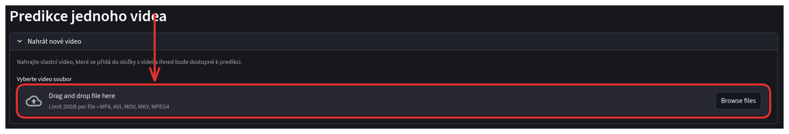
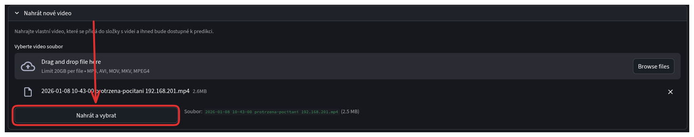
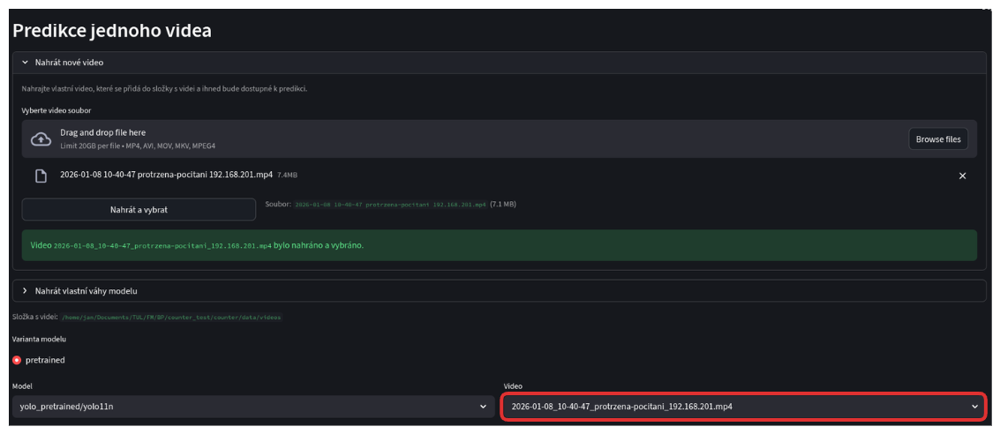

### Nahrání videa
Připravte si video ve formátu MP4, AVI, MOV, MKV nebo MPEG4, které je menší než 20 GB.

V sekci pro výběr videa klikněte na tlačítko pro nahrání videa. Vyberte soubor s videem, které chcete zpracovat, a potvrďte nahrání. Po úspěšném nahrání by se video mělo objevit v nabídce pro výběr videa.

Poté, klikněte na šedé tlačítko pro výber videa a vyberte své video.

Po zvolení videa počkejte až se nahraje a potrďte výběr zmáčknutím tlačítka "Nahrát a vybrat". Vždy je možné nahrát pouze jedno video.

Nyní se objeví hláška o úspěšném nahrání a video bude připraveno k výběru v sekci níže.

Tímto je video nahráno a připraveno k použití v predikční pipeline. Můžete přejít k nastavení čáry pro počítání průchodů a spuštění predikce.

- [Další část: Nahrání modelu](./02_nahrani_modelu.md)
- [Zpět na obsah](../index.md)