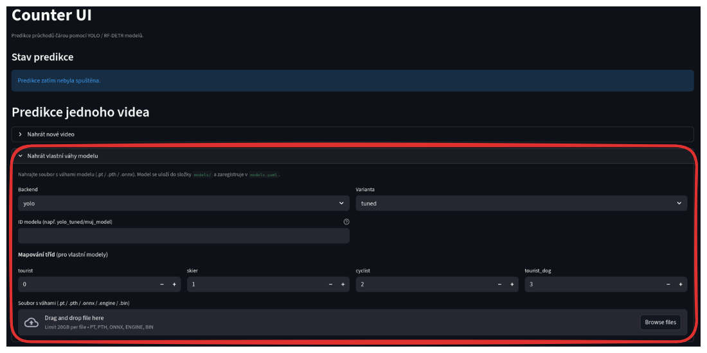
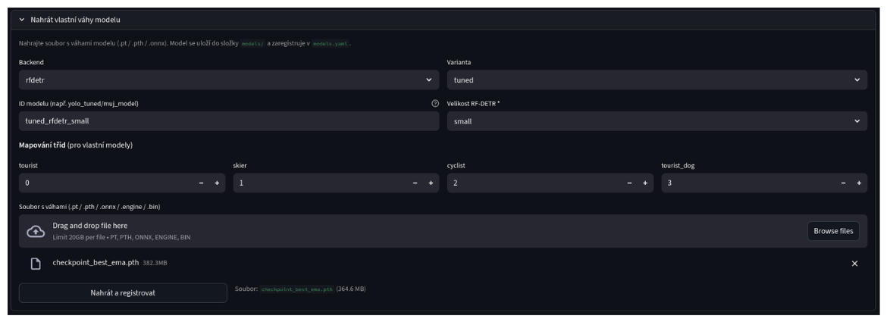
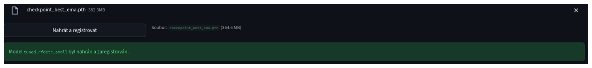

# Nahrání modelu
*V aplikaci jsou již k dispozici předtrénované modely. Tato sekce slouží primárně k tomu, aby uživatel mohl nahrát vlastní (natrénovaný) model. Pokud chcete použít některý z předtrénovaných modelů, není potřeba nahrávat vlastní model a můžete rovnou přejít k výběru modelu a videa [zde](./03_predikce.md).*

---

Pokud chcete použít vlastní model, připravte si model ve formátu PT, nebo PTH. Model musí být kompatibilní s architekturou, kterou systém podporuje. V současnosti je to Ultralytics YOLO a Roboflow RF-DETR.

Podobně jako u videa rozklikněte rozbalovací menu "Nahrát vlastní váhy modelu". 

Zde je vidět několik možností výběru.

- **Backend** - YOLO, nebo RF-DETR. Zvolte ten, který odpovídá vašemu modelu.
- **Varianta** - Výchozí je tuned. Pokud máte model, který je pouze předtrénovaný na obecné datové sadě (např. COCO), zvolte variantu pretrained.
- **ID modelu** - Bude sloužit pro identifikaci modelu v systému. Ideálně čísla a malá písmena bez diakritiky, bez mezer a speciálních znaků. 
- **Mapování tříd** - číslo které zadáte namapuje třídy z vašeho modelu na třídy, tourist, skier, cyclist, tourist_dog. Více podrobností na konci této stánky.
- **Velikost RF-DETR modelu** - pouze pokud používáte RF-DETR, zvolte velikost modelu. Je to nutné pro správné zpracování modelu v systému. 

Až vyplníte tato pole, klikněte na tlačítko "Drag and drop file here" a vyberte soubor s modelem.

Objeví se tlačítko "Nahrát a registrovat". Akci dokončete kliknutím na toto tlačítko.

Po úspěšném nahrání se objeví hláška o úspěšném nahrání modelu. Nyní je model připraven k použití v predikční pipeline. Můžete přejít k nastavení čáry pro počítání průchodů a spuštění predikce. 

- [Předchozí část: Nahrání videa](./01_nahrani_videa.md)
- [Další část: Spuštění predikce](./03_predikce.md)
- [Zpět na obsah](../index.md)

## Podrobnější vysvětlení mapování tříd

Pokud váš model rozezná lyžaře jako třídu `0`, cyklistu jako třídu `1` a turistu jako třídu `2`. Zadáte tato čísla přesně tak, jak jsou ve vašem modelu. Tato informace slouží softwaru správně určit o jakou třídu se jedná. 

| Třída v systému | Odpovídající třída v modelu |
|-----------------|-----------------------------|
| tourist         | 2                           |
| skier           | 0                           |
| cyclist         | 1                           |

**V datasetu COCO jsou třídy pojmenované následovně:**
| Třída v systému | Odpovídající třída v COCO |
|-----------------|-----------------------------|
| tourist         | person (1)                  |
| skier           | skis (31)                   |
| cyclist         | bicycle (2)                 |
| tourist_dog     | dog (17)                    |