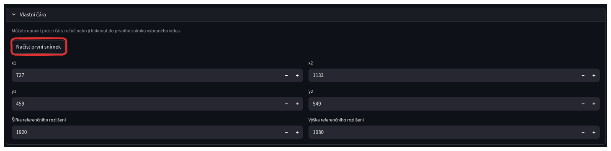
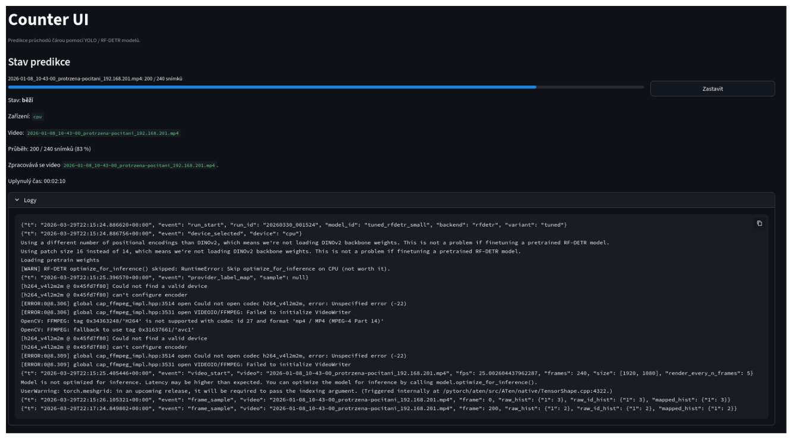
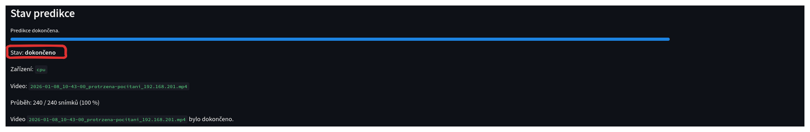

# Spuštění predikce

Na stránce najděte sekci pro výběr modelu a videa. 

- **Vyberte variantu modelu** - Pokud jste dříve nahráli natrénovaný model, máte zde možnost zvolit variantu `tuned`. Pokud chcete použít předtrénovaný model, zvolte variantu `pretrained`. 
- **Vyberte model** - Zvolte model, který chcete použít pro predikci.
- **Vyberte video** - Zvolte video, které chcete zpracovat. Pokud zde není žádné video k výběru, je potřeba nejprve nahrát video podle návodu [zde](./01_nahrani_videa.md).
- **Vykreslit každý n-tý snímek** - Toto nastavení určuje jemnost výsledného videa. Výchozí hodnota 5 znamená, že bude vykreslen každý pátý snímek. 
- **Vlastní čára** - Doporučejeme nastavit vlastní polohu čáry pro počítání průchodů. 

## Instrukce pro zvolení vlastní čáry
Klikněte na tlačítko "Vlastní čára" pro rozbalení nabídky pro nastavení čáry. Zde máte možnost nastavit vlastní polohu čáry pro počítání průchodů.

*Poznámka: před načítáním prvního snímku videa proveďte znovunačtení stránky (`CTRL + R`).*

Lze tak učinit dvěma způsoby:
1. **Zadejte souřadnice čáry ručně** - Pokud znáte přesné souřadnice pro začátek a konec čáry, můžete je zadat do příslušných polí. Souřadnice by měly být ve formátu `x,y` (např. `100,200`). Také zadejte rozlišení videa.
2. **Nastavení čáry nad prvním snímkem videa (Doporučené)** - Po kliknutí na tlačítko "Nastavit čáru nad prvním snímkem videa" se načte první snímek zvoleného videa a zobrazí se nástroj pro nastavení čáry. 

 

Zobrazí se nástroj pro nastavení čáry. Prvním kliknutím označíte místo, kde má čára začínat. Druhým kliknutím označíte místo, kde má čára končit. 

Následně kikněte na tlačítko "Požít naklikané body" pro potvrzení nastavení čáry.

## Spuštění

Po nastavení všech parametrů klikněte na tlačítko "Spustit predikci". 

## Průběh predikce

Po spuštění predikce se zobrazí průběh běhu.

V horní části se zobrazuje aktuální stav běhu, počet zpracovaných snímků, stav, zařízení na kterém predikce běží, zpracovávané video a uplynulý čas.

Lze také zobrazit detailní logy z běhu, které mohou být užitečné pro kontrolu průběhu.

Po dokončení běhu se stav změní na "dokončeno".
 