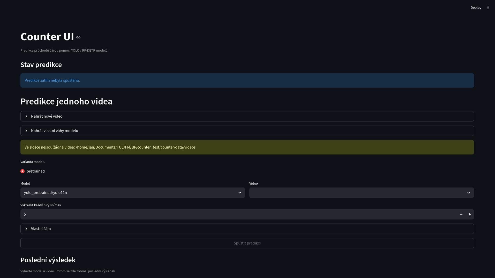

# Jak spustit webové rozhraní pro provedení predikce na videu

Tento návod popisuje nejjednodušší způsob práce se systémem přes webové rozhraní. Postup je vhodný hlavně pro uživatele, kteří chtějí rychle vybrat video, nastavit čáru a zkontrolovat výsledky bez detailní práce s příkazovou řádkou.

## Předpoklady
Nejprve si připravte prostředí projektu. Ujistěte se, že máte nainstalované závislosti, že ve složce s videi existuje vstupní záznam a že soubor `configs/models.yaml` obsahuje modely, které chcete v rozhraní vybírat.

## Spuštění aplikace
Nainstalujte závislosti projektu:

```bash
uv sync
```

Spusťte webové rozhraní:

```bash
uv run counter-ui
```

Potom otevřete prohlížeč a přejděte na adresu [`http://localhost:8501`](http://localhost:8501). Bude zde vidět úvodní obrazovka jako na následujícím obrázku.




# Další kroky

## Nahrání videa a modelu
Po otevření rozhraní jsou v aplikaci ke zvolení pouze předtrénované modely a žádná videa. 

Pokud tedy chcete zpracovat vlastní video, nebo použít vlastní model, je potřeba nejprve nahrát video, či model pomocí uživatelského rozhraní.

- [Nahrání videa](./01_nahrani_videa.md)
- [Nahrání modelu](./02_nahrani_modelu.md)

## Spuštění predikce a kontrola výsledků
Po nahrání videa a modelu můžete přejít k nastavení čáry pro počítání průchodů a spuštění predikce.

- [Spuštění predikce](./03_predikce.md)
- [Kontrola výsledků](./04_kontrola_vysledku.md)

# Video návod
Pro vizuální představu o práci s rozhraním se můžete podívat na tento krátký video návod, který ukazuje základní kroky od spuštění rozhraní až po kontrolu výsledků.


[](https://youtu.be/wDchsz8nmbo?si=r6Zp693EWs1j6dGG)